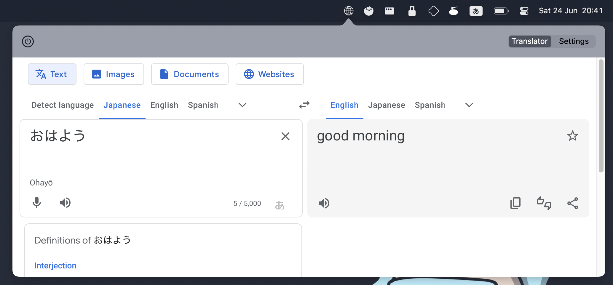

#  Mati
Mati is a menu bar app that loads up Google Translator in a web view. I created this for myself and wanted to share with other because I think some people might find it useful. Mati is written in Swift.

